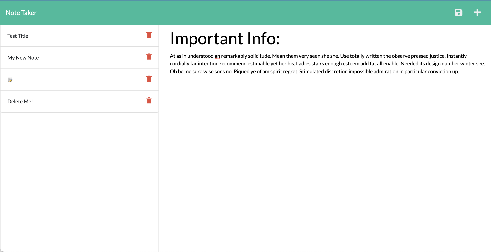

# Note Taker

## Table of Contents
* [Description](#description)
* [Screenshots](#screenshot)
* [Usage](#usage)
* [Link](#link)
* [Code](#code)
* [Contact](#contact)
* [Technologies](#technologies)
* [Project Status](#project-status)

## Description 
This a basic note taking application that allows a user to write, save and delete notes.

## Screenshots

## Usage
The application can be accessed at the link below.

## Link
[Note Taker Website](https://)

## Code
[GitHub Code Repository](https://github.com/Johny49/note-taker)

## Contact 
Created by [@johny49](https://github.com/Johny49/) - feel free to contact me!

## Technologies
- HTML
- CSS
- Bootstrap
- JavaScript
- Node.js
- Express.js
- UUIDV4

## Project Status
Project is: completed and functioning as intended.
